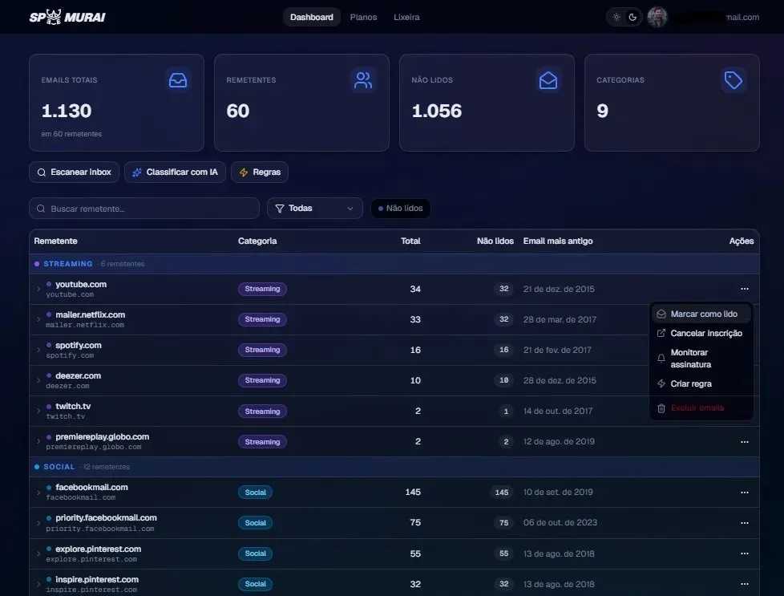
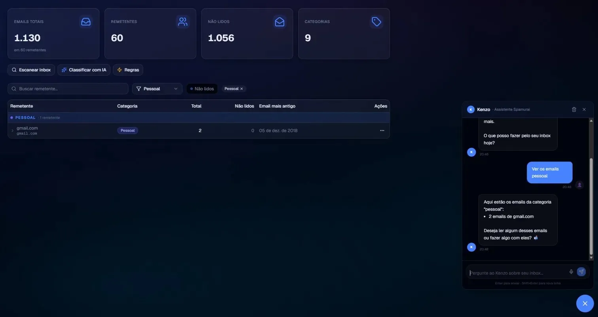
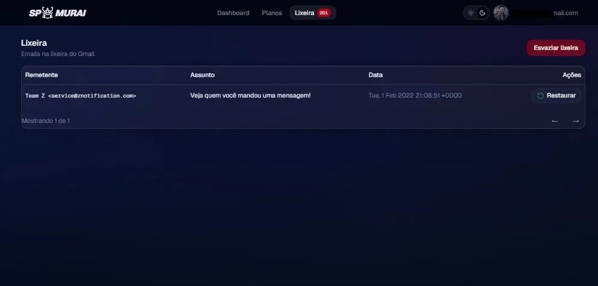
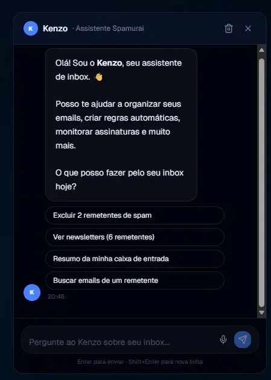

# ⚔️ Spamurai

> AI-powered inbox management — classify, clean, and control your Gmail with precision.


**Spamurai** is a fullstack portfolio project demonstrating real-world engineering across modern web development, async task processing, AI integration, and OAuth-based authentication — all in a cohesive, production-shaped application.

---

## Screenshots

| Dashboard | AI Chat (Kenzo) |
|---|---|
|  |  |

| Lixeira | Configurações PRO |
|---|---|
|  |  |

---

## Features

- **Gmail OAuth2** — secure login with Google, scoped to Gmail access only
- **Inbox scanning** — indexes up to 5,000 emails via Gmail API with real-time SSE progress
- **AI classification** — categorizes senders into 10 categories using Groq (LLaMA 3.3 70B)
- **Kenzo AI Chat** — conversational assistant with function calling: filter, delete, summarize
- **Bulk delete** — permanent deletion with monthly limits enforced per plan (Free: 50/month)
- **Trash management** — view, restore, and permanently empty Gmail trash
- **Auto rules** — define conditions to automatically act on incoming senders
- **Subscription monitoring** — track and alert on recurring sender activity
- **5 themes** — dark/light variants with full CSS variable theming
- **Plan system** — Free / Pro / Business with feature gating on backend and frontend
- **Async processing** — Celery + Redis task queue for long-running Gmail operations

---

## Architecture

```
┌─────────────────┐     ┌──────────────────────────────────────┐
│   Next.js 15    │────▶│           FastAPI Backend             │
│   TypeScript    │     │                                       │
│   TanStack      │     │  ┌─────────┐  ┌──────────────────┐  │
│   Query         │     │  │ Routers │  │  Groq AI Service │  │
│   Tailwind CSS  │     │  │ auth    │  │  LLaMA 3.3 70B   │  │
└─────────────────┘     │  │ gmail   │  └──────────────────┘  │
                        │  │ ai_chat │                          │
                        │  │ rules   │  ┌──────────────────┐  │
                        │  │ plans   │  │  Celery Workers  │  │
                        │  └─────────┘  │  Redis Broker    │  │
                        │               └──────────────────┘  │
                        │  ┌──────────────────────────────┐   │
                        │  │  PostgreSQL (SQLAlchemy async)│   │
                        │  └──────────────────────────────┘   │
                        └──────────────────────────────────────┘
                                          │
                                ┌─────────────────┐
                                │   Gmail API v1   │
                                │   Google OAuth2  │
                                └─────────────────┘
```

---

## Tech Stack

| Layer | Technology |
|---|---|
| Frontend | Next.js 15, TypeScript, Tailwind CSS, TanStack Query |
| Backend | FastAPI, Python 3.11, SQLAlchemy (async), Pydantic |
| Database | PostgreSQL |
| Queue | Celery + Redis |
| AI | Groq API — LLaMA 3.3 70B (function calling) |
| Auth | Google OAuth2 — AES-256-GCM encrypted refresh tokens |
| Real-time | Server-Sent Events (SSE) for scan progress |

---

## Security

- Refresh tokens encrypted at rest with AES-256-GCM
- CSRF protection via Redis-backed OAuth state (TTL: 10min)
- IDOR protection — all queries scoped to authenticated user ID
- SSRF guard on unsubscribe endpoint
- Rate limiting via SlowAPI
- Security headers middleware (HSTS, CSP, X-Frame-Options)
- Audit log for all destructive actions
- Input validation at every system boundary
- `OAUTHLIB_RELAX_TOKEN_SCOPE` handled without exposing scope mismatch to users

---

## Running Locally

### Prerequisites

- Docker (PostgreSQL + Redis)
- Python 3.11+
- Node.js 20+ or Bun
- Google Cloud project with OAuth2 credentials and Gmail API enabled

### Setup

```bash
# Clone
git clone https://github.com/fcarvalho-dev/spamurai.git
cd spamurai

# Start infrastructure
docker-compose up -d

# Backend
cd backend
python -m venv .venv
.venv/Scripts/activate  # Windows
pip install -r requirements.txt
cp .env.example .env    # Fill in your credentials
python migrate.py
uvicorn main:app --port 8000

# Celery worker (new terminal)
celery -A workers.scraper.celery_app worker --loglevel=info --pool=solo

# Frontend (new terminal)
cd frontend
bun install
bun dev
```

Open [http://localhost:3000](http://localhost:3000)

---

## Environment Variables

Copy `.env.example` to `.env` and fill in the values:

```bash
cp backend/.env.example backend/.env
```

See [`.env.example`](backend/.env.example) for all required variables.

---

## Project Structure

```
spamurai/
├── backend/
│   ├── core/           # Config, security, plan system
│   ├── models/         # SQLAlchemy schema
│   ├── routers/        # FastAPI endpoints
│   │   ├── auth.py     # Google OAuth2 flow
│   │   ├── gmail.py    # Gmail API operations
│   │   ├── ai_chat.py  # Kenzo AI with function calling
│   │   ├── rules.py    # Auto rules CRUD
│   │   └── plans.py    # Plan management
│   ├── services/       # AI and Gmail service wrappers
│   ├── workers/        # Celery async tasks
│   └── main.py         # FastAPI app + middleware
└── frontend/
    ├── app/            # Next.js App Router
    │   └── dashboard/  # Dashboard, trash, settings
    ├── components/     # UI components
    │   └── dashboard/  # Stats, table, AI chat, header
    └── lib/            # API client, types, hooks
```

---

## Author

**Felipe Carvalho** — Fullstack Developer

[](https://www.linkedin.com/in/felipe-santos-2389633b7/)
[](https://github.com/fcarvalho-dev)

---

*Built as a portfolio project to demonstrate fullstack engineering across modern web, async processing, AI integration, and production-grade security practices.*

